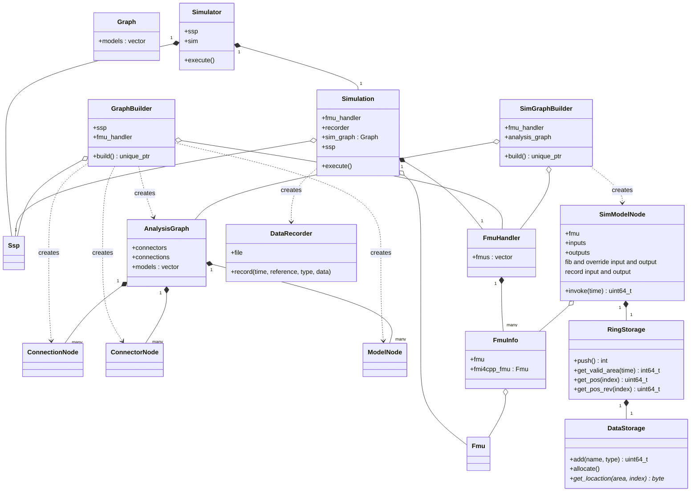

```mermaid
classDiagram
    
    class Fmu {
    }
    class Ssp {
    }
    class ConnectionNode {
    }
    class ConnectorNode {
    }
    class ModelNode {
    }
    class AnalysisGraph {
        +connectors
        +connections
        +models : vector<ModelNode>
    }
    class GraphBuilder {
        +ssp
        +fmu_handler
        +build() unique_ptr
    }
    class SimModelNode {
        +fmu
        +inputs
        +outputs
        
        fib and override input and output
        record input and output
        +invoke(time) uint64_t
    }
    class Graph {
        +models : vector<SimModelNode> 
    }
    class SimGraphBuilder {
        +fmu_handler
        +analysis_graph
        +build() unique_ptr
    }
    class FmuInfo {
        +fmu
        +fmi4cpp_fmu : Fmu
    }
    class FmuHandler {
        +fmus : vector<FmuInfo>
    }
    class Simulation {
        +fmu_handler
        +recorder
        +sim_graph : Graph
        +ssp
        +execute()
    }
    class Simulator {
        +ssp
        +sim
        +execute()
    }
    class RingStorage {
        +push() int
        +get_valid_area(time) int64_t
        +get_pos(index) uint64_t
        +get_pos_rev(index) uint64_t
    }
    class DataStorage {
        +add(name, type) uint64_t
        +allocate()
        +get_locaction(area, index) byte*
    }
    class DataRecorder {
        +file
        +record(time, reference, type, data)
    }

    Simulator "1" *-- "1" Simulation
    Simulator "1" *-- "1" Ssp

    Simulation "1" *-- "1" FmuHandler
    Simulation ..> DataRecorder : creates
    Simulation o-- Ssp
    Simulation o-- Fmu

    FmuHandler "1" *-- "many" FmuInfo
    FmuInfo o-- Fmu

    GraphBuilder ..> AnalysisGraph : creates
    GraphBuilder ..> ModelNode : creates
    GraphBuilder ..> ConnectorNode : creates
    GraphBuilder ..> ConnectionNode : creates
    GraphBuilder o-- Ssp
    GraphBuilder o-- FmuHandler

    AnalysisGraph "1" *-- "many" ModelNode
    AnalysisGraph "1" *-- "many" ConnectorNode
    AnalysisGraph "1" *-- "many" ConnectionNode

    SimGraphBuilder ..> SimModelNode : creates
    SimGraphBuilder o-- FmuHandler
    SimGraphBuilder o-- AnalysisGraph

    SimModelNode o-- FmuInfo
    SimModelNode "1" *-- "1" RingStorage

    RingStorage "1" *-- "1" DataStorage
```