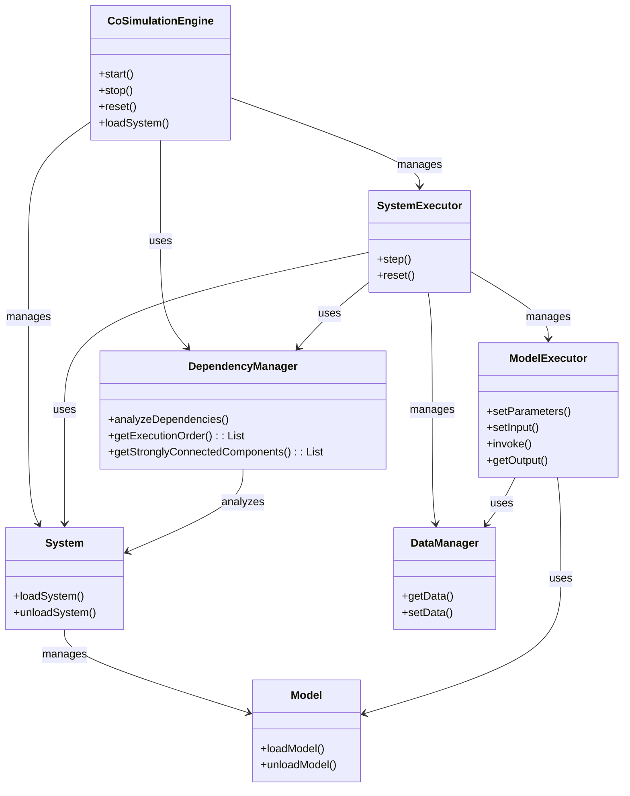

```mermaid
classDiagram
    class CoSimulationEngine {
        +start()
        +stop()
        +reset()
        +loadSystem()
    }
    CoSimulationEngine --> System : manages
    CoSimulationEngine --> SystemExecutor : manages
    CoSimulationEngine --> DependencyManager : uses

    class System {
        +loadSystem()
        +unloadSystem()
    }
    System --> Model : manages

    class Model {
        +loadModel()
        +unloadModel()
    }

    class SystemExecutor {
        +step()
        +reset()

    }
    SystemExecutor --> ModelExecutor : manages
    SystemExecutor --> DataManager : manages
    SystemExecutor --> System : uses
    SystemExecutor --> DependencyManager : uses

    class ModelExecutor {
        +setParameters()
        +setInput()
        +invoke()
        +getOutput()
    }
    ModelExecutor --> Model : uses
    ModelExecutor --> DataManager : uses


    class DataManager {
        +getData()
        +setData()

    }


    class DependencyManager {
        +analyzeDependencies()
        +getExecutionOrder(): List
        +getStronglyConnectedComponents(): List
    }
    DependencyManager -->  System: analyzes


```